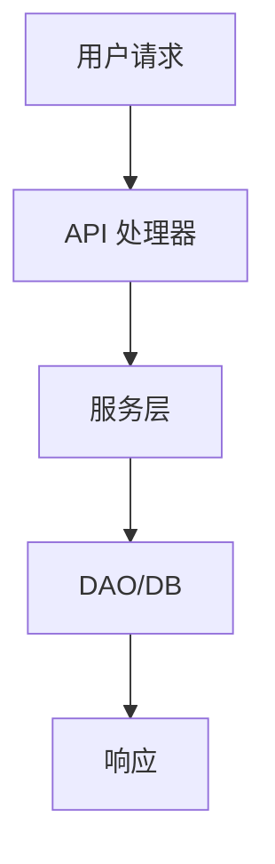

# [组件/功能] 学习报告（FastAPI）

## 概述
[分析对象与目标]

## 架构概览
[高层架构图或描述]

## 核心组件

### [组件 1：名称]
**文件**：`[path/to/file.py:line:col]`
**用途**：[作用]
**关键方法**：[方法列表（含行列）]
**关键代码片段**：
```python
# 关键代码示例
[代码片段]
```
[详细分析...]

## 执行流程

### 逐步执行过程
1. **[步骤 1]**：[描述]
   - 位置：`[file:line:col]`
   - 方法：`[method_name]`
   - 调用链：[incoming/outgoing 概要]
   - 关键代码片段：
```python
[代码片段]
```
   - 注释与解释：[说明]

### 流程图（Mermaid）


## 数据流
- 输入：格式与校验
- 处理：转换与状态变化
- 输出：格式与存储

## 特殊机制
- [机制 1]

## 依赖项
- 内部/外部依赖清单

## 错误处理
- 各层策略

## 性能考虑
- 关键路径 & 优化点

## 安全考虑
- 认证/鉴权/敏感数据处理
