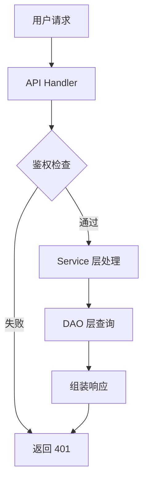
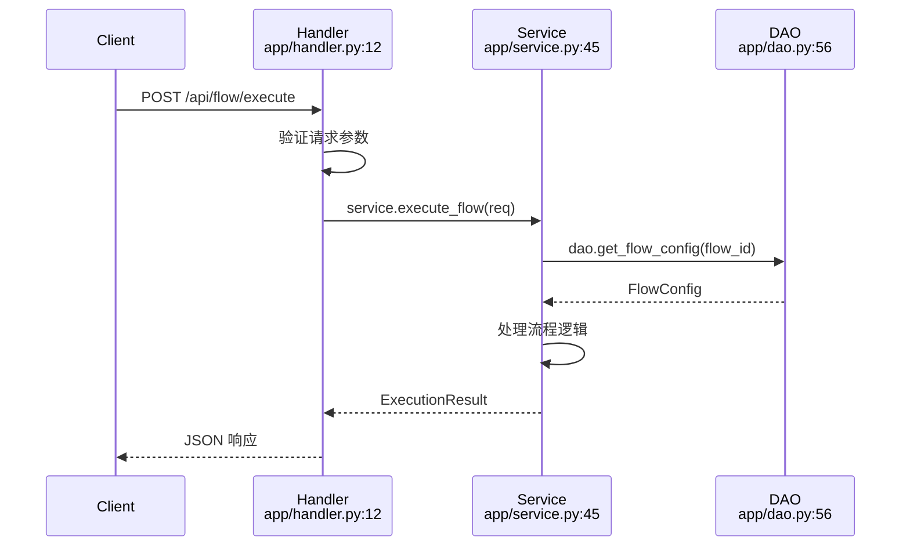
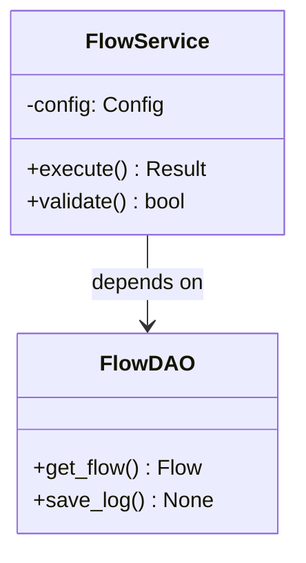

---

name: project-learning-report-fastapi

description: 生成 FastAPI 项目学习报告,接口、方法执行报告，完成后自动清理，仅保留最终报告。

allowed-tools: Read, Grep, Glob, LSP, Write, Bash

---
# 核心原则（LSP-first & Token 优化）

## 1. API 入口定位流程（FastAPI 项目）

```
┌─────────────────────────────────────────────────────────────────────────┐
│                         API 入口定位工作流                                │
├─────────────────────────────────────────────────────────────────────────┤
│                                                                          │
│  Step 1: 定位 main.py 并获取路由前缀                                      │
│    └─ 使用 Glob/Read 找到项目入口文件 main.py                            │
│    └─ 识别 APIRouter.include_router() 或 @app.get/post等装饰器           │
│    └─ 提取路由前缀（如 /api/v3, /api/internal 等）                        │
│                                                                          │
│  Step 2: 使用 LSP 定位视图层（View/Handler）                              │
│    └─ 根据路由前缀 + 端点路径定位对应的视图函数                           │
│    └─ 使用 goToDefinition 定位视图函数定义位置                            │
│    └─ 使用 documentSymbol 获取视图函数的符号信息                          │
│                                                                          │
│  Step 3: 逐层向下追踪（使用 LSP）                                         │
│    ├─ View → Service: 使用 incomingCalls/outgoingCalls 追踪调用链       │
│    ├─ Service → DAO: 同样使用 LSP 调用链分析                            │
│    ├─ Schema: 使用 goToDefinition 定位 Pydantic 模型                     │
│    └─ Type/Interface: 使用 goToImplementation 查找实现类                │
│                                                                          │
│  Step 4: 仅在必要时使用 Grep                                             │
│    └─ 当 LSP 无法解析路由字符串（如动态路径）时                          │
│    └─ 当需要搜索跨文件的非符号引用时                                      │
│                                                                          │
├─────────────────────────────────────────────────────────────────────────┤
│  明确分析对象：端点（示例：GET /api/v3/flow/execute）、方法/函数、组件     │
│  如需澄清：端点/方法/组件具体名称？深度（概述 vs 深度追踪）？关注重点？    │
└─────────────────────────────────────────────────────────────────────────┘
```

## 2. LSP 优先原则

所有符号定位、调用链、跳转定义、文档/类型信息，**优先使用 LSP**：

| LSP 工具 | 用途 |
|----------|------|
| `goToDefinition` | 跳转到定义（函数、类、变量） |
| `findReferences` | 查找引用位置 |
| `documentSymbol` | 获取当前文件的符号树 |
| `workspaceSymbol` | 全局搜索符号 |
| `goToImplementation` | 跳转到接口实现 |
| `incomingCalls` | 查找调用者 |
| `outgoingCalls` | 查找被调用的函数 |

只有当 LSP 无法解析路由字符串时，才使用 Grep。

## 3. 最小必要读取原则

对代码文件的 `Read` 操作必须来源于 LSP 或经由路由字符串映射后的精确文件路径；避免全库扫描或长篇粘贴。


# FastAPI 学习报告生成工作流（必须严格遵循）

## ⚠️ 强制执行规则

生成报告时**必须严格执行以下完整流程**，禁止跳过任何步骤或随意修改顺序。

### 不允许的行为：
- ❌ 直接分析代码生成完整报告，跳过脚本流程
- ❌ 在步骤 A/B/C/D 之间插入额外操作
- ❌ 自行修改进度文件内容
- ❌ 使用非脚本的 Write 操作修改 `docs/` 下的报告文件
- ❌ 完成前删除临时文件

### 必须使用脚本：
所有报告内容的生成、提交、合并、清理操作，**必须通过 `scripts/` 目录下的 Python 脚本完成**。

---

## 工作流程图（完整闭环）

```
┌─────────────────────────────────────────────────────────────────────────┐
│                     FastAPI 学习报告生成完整流程                         │
├─────────────────────────────────────────────────────────────────────────┤
│                                                                          │
│  [STEP 0] 环境自检（每会话一次）                                          │
│    └─ 检测并设置 PY 变量指向正确的 Python 解释器                          │
│                                                                          │
│              ↓                                                           │
│                                                                          │
│  [STEP A] 初始化报告（每功能只执行一次）                                  │
│    └─ 运行 init_report.py 创建报告骨架                                    │
│    └─ 生成空的 docs/{{feature}}_analysis.md                                │
│    └─ 创建进度跟踪文件 .claude/tmp/{{feature}}_progress.json                       │
│                                                                          │
│              ↓                                                           │
│                                                                          │
│  [STEP B] 建立任务队列（每功能只执行一次）                                │
│    └─ 运行 set_queue.py 定义要分析的组件                                  │
│    └─ 输入：handler, service, dao 等符号位置                              │
│    └─ 输出：更新进度文件，建立执行队列                                    │
│                                                                          │
│              ↓                                                           │
│                                                                          │
│  [STEP C] 批次循环（每个队列任务执行一次）                                │
│    ┌─────────────────────────────────────────────────────────────────┐  │
│    │  C1. show_next.py - 显示下一个要分析的任务                         │  │
│    │      ↓                                                            │  │
│    │  C2. new_chunk_stub.py - 生成 markdown 骨架                        │  │
│    │      ↓                                                            │  │
│    │  C3. new_meta_stub.py - 生成 metadata JSON 骨架                    │  │
│    │      ↓                                                            │  │
│    │  C4. 用 LSP/Read 填充 task_meta.json（人工 + LSP 工具）            │  │
│    │      ↓                                                            │  │
│    │  C5. enrich_stub.py - 将 metadata 注入到 chunk                     │  │
│    │      ↓                                                            │  │
│    │  C6. 用 Write 微调 chunk.md（补代码片段≤30行）                     │  │
│    │      ↓                                                            │  │
│    │  C7. commit_batch.py - 提交本批内容到最终报告                       │  │
│    └─────────────────────────────────────────────────────────────────┘  │
│                    ↓ (队列中还有任务？返回 C1)                           │
│                    ↓ (队列空了，继续)                                     │
│                                                                          │
│  [STEP D] 完成与清理（必须）                                              │
│    └─ 运行 finalize_cleanup.py                                           │
│    └─ 添加最终章节（CONCLUSION, REFERENCES）                             │
│    └─ 删除临时目录和进度文件                                               │
│                                                                          │
└─────────────────────────────────────────────────────────────────────────┘
```

---

## 变量与文件约定

- 最终报告：`docs/$FEATURE_analysis.md`
- 进度文件（中间）：`$TMPDIR/progress.json`（完成后删除）
- 临时目录（中间）：`$TMPDIR/`（完成后删除），包含：
  - `chunk.md`
  - `task_meta.json`

> 统一环境变量（步骤 0 中一次性设置）：
> - `FEATURE`：当前分析的功能名称（如 `flow_execute`）
> - `PY`：项目 Python 解释器（**可覆写 + 自动探测**）
> - `TMPDIR=.claude/tmp/$FEATURE`：临时目录

---

## 快速命令参考（按步骤顺序执行）

> ⚠️ **警告**：下方的命令仅作快速参考，执行时请务必理解上方"工作流程图"中的完整逻辑。
> 所有命令必须按 0→A→B→C(×N)→D 的顺序执行，不可跳过或乱序。

### 步骤 0 - 环境自检（每轮会话执行一次）

> 执行一次即可，后续 A/B/C/D 均直接使用 `$PY` 和 `$TMPDIR`。
> 每个功能分析前还需设置 `FEATURE` 变量。

```bash
# --- 1. 设置功能名称（每个功能分析前必须设置）---
FEATURE="{{feature}}"
echo "Analyzing feature: $FEATURE"

# --- 2. 探测并设置 PY（Python 解释器）---
if [ -n "${PY:-}" ] && [ -x "$PY" ]; then
  :
elif [ -x "./venv/bin/python" ]; then
  PY="./venv/bin/python"
elif [ -x "./.venv/bin/python" ]; then
  PY="./.venv/bin/python"
elif command -v python3 >/dev/null 2>&1; then
  PY="$(command -v python3)"
elif command -v python >/dev/null 2>&1; then
  PY="$(command -v python)"
else
  echo "ERROR: 找不到可用的 Python 解释器。请先创建/激活虚拟环境，或手动指定 PY=/path/to/python"
  exit 1
fi
export PY

# --- 3. 设置 TMPDIR（临时目录）---
TMPDIR=".claude/tmp/$FEATURE"
export TMPDIR

echo "Using PY=$PY"
echo "Using TMPDIR=$TMPDIR"
```

> 手动覆写示例：
>
> ```bash
> FEATURE="my-feature"
> PY="/path/to/.venv/bin/python"
> export FEATURE PY
> TMPDIR=".claude/tmp/$FEATURE"
> export TMPDIR
> ```

### 步骤 A - 初始化（每个功能只执行一次）

```bash
$PY scripts/init_report.py --feature "$FEATURE" --endpoint "{{endpoint}}"
```

### 步骤 B - 建立任务队列（每个功能只执行一次）

```bash
$PY scripts/set_queue.py --prog "$TMPDIR/progress.json" \
  --handler "{handler_symbol}" --handler-loc "{handler_loc}" \
  --add "service:{svc_symbol}:{svc_loc}" \
  --add "dao:{dao_symbol}:{dao_loc}" \
  --with-final-sections
```

### 步骤 C - 批次循环（每个队列任务执行一次，直到队列清空）

> ⚠️ 每个子步骤必须依次完成，不可跳过
> ⚠️ 步骤 0 中已设置 `$TMPDIR`，直接使用即可

C1. 显示下一任务：

```bash
$PY scripts/show_next.py --feature "$FEATURE"
```

C2. 生成 chunk 骨架：

```bash
mkdir -p "$TMPDIR"
$PY scripts/new_chunk_stub.py --feature "$FEATURE" --out "$TMPDIR/chunk.md"
```

C3. 生成 meta JSON 骨架：

```bash
$PY scripts/new_meta_stub.py --feature "$FEATURE" --out "$TMPDIR/task_meta.json"
```

C4. 用 LSP/Read 填充 `$TMPDIR/task_meta.json`（使用 LSP 工具 + Read 收集信息，然后 Write）

C5. 注入 meta 到 chunk：

```bash
$PY scripts/enrich_stub.py --feature "$FEATURE" --stub "$TMPDIR/chunk.md" --meta "$TMPDIR/task_meta.json"
```

C6. 用 Write 微调 `$TMPDIR/chunk.md`（补代码片段≤30行，确保无 REPLACE_ME，包含真实 `file.py:line:col`）

C7. 提交本批：

```bash
$PY scripts/commit_batch.py --feature "$FEATURE" --chunk-md "$TMPDIR/chunk.md"
```

> 队列还有任务？重复 C1-C7。
> 队列已清空？继续步骤 D。

---

### 步骤 D - 完成与清理（必须执行）

```bash
$PY scripts/finalize_cleanup.py --feature "$FEATURE"
```

---

## Mermaid 图表规范

所有流程图、时序图必须使用 **Mermaid** 语法，确保图表可渲染且易于理解。

### 流程图（flowchart） - 用于架构概览、执行流程



**规范**：
- 使用 `flowchart TD`（自上而下）或 `flowchart LR`（从左到右）
- 节点名称简洁首字母大写，使用中括号 `[]` 表示矩形节点
- 使用 `-->` 表示流程
- 条件分支使用 `{}` 菱形节点，在箭头上标注条件 `|通过|`

### 时序图（sequenceDiagram）- 用于调用链、数据交互



**规范**：
- 使用 `sequenceDiagram`
- 定义参与者时使用缩写和完整名称，如 `H as Handler<br/>file:line`
- 使用 `->>` 表示同步调用，`-->>` 表示返回消息
- 在消息下方使用箭头后的位置描述操作细节
- 文件位置用 `<br/>` 换行显示

### 类图（classDiagram）- 用于组件关系说明



### 通用规则

1. **每个组件关联代码位置**：在节点或参与者名称中包含 `file.py:line:col`
2. **避免过于复杂**：单图节点不超过 12 个，必要时拆分为多个图表
3. **使用中文标签**：所有节点、消息描述使用中文，技术术语保持英文
4. **统一命名**：文件位置使用相对路径，如 `app/services/flow.py:45:2`
5. **实时验证**：生成图表后确认语法正确（可在 Markdown 预览中检查）

---

## 原始报告模板

- [reference/REPORT_TEMPLATE.md](reference/REPORT_TEMPLATE.md)

- 并确保所有方法/符号位置包含 `file.py:line:col`